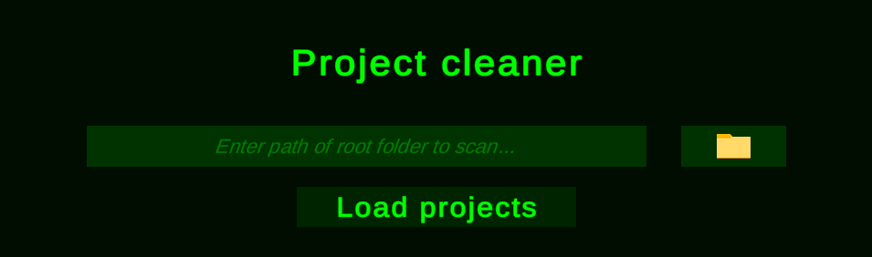
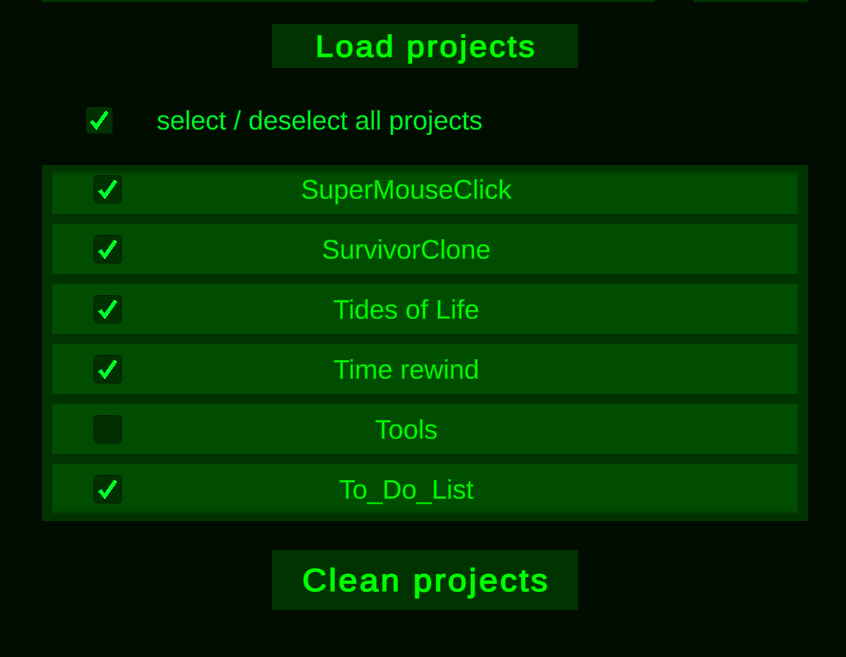
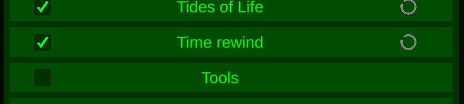
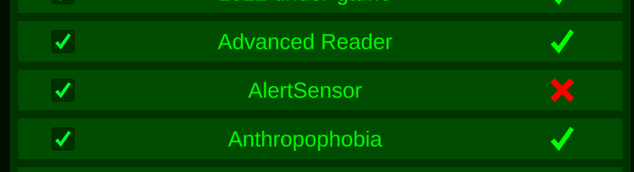
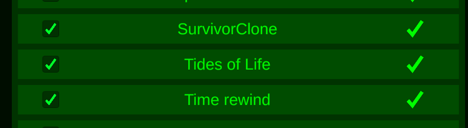

# ProjectCleaner

A tool to reduce the disk size of your Unity projects when not in use.

## Usage

Provide the path to the folder containing the Unity projects you want to scan, either as pain text or using the folder picker button.\
Click the "Load projects" button to start detection of the projects.

Once projects are loaded this tool will display them in the list. You can click a project name to open its folder.\
You can then select the projects you want to clean and click the "Clean projects" button to start the cleaning process.

This tool will remove Unity generated folders such as the "Library" folder.\
**This will not remove any user generated folders or anything in the "Assets" folder.**

The process can last longer times if many projects are provided.

Once the cleaning process is finished, the tool will display the total size of deleted elements, this is the **size you've just gained on your disk**.

## Project status

During the removal spinners will be displayed on non-cleaned folders.\
Some projects might be stuck on cleaning and need manual intervention.

Some projects might fail to clean due to permissions or project corruption, in which case a cross will appear.

When cleaning is finished a checkmark will appear next to the project name.

## Support

This tool was made with Unity 2019 and has been tested with projects as old as Unity 2017 and as new as Unity 2022.\
It's process depends on Unity's folder structure and should still be working with newer versions as long as the folder structure is the same.

## Disclaimer

This software is provided "as is".\
I am not responsible for any damage this software or its misuse could inflict on your system.

## Builds

For now, the only available build is for Windows.
Feel free to build your own version **(Unity version 2020.3.20f1)**.